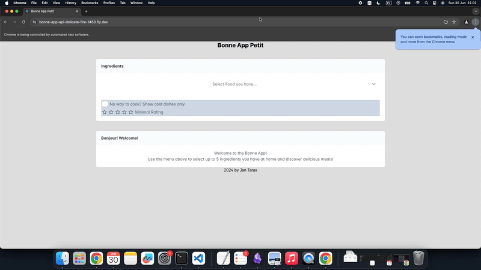
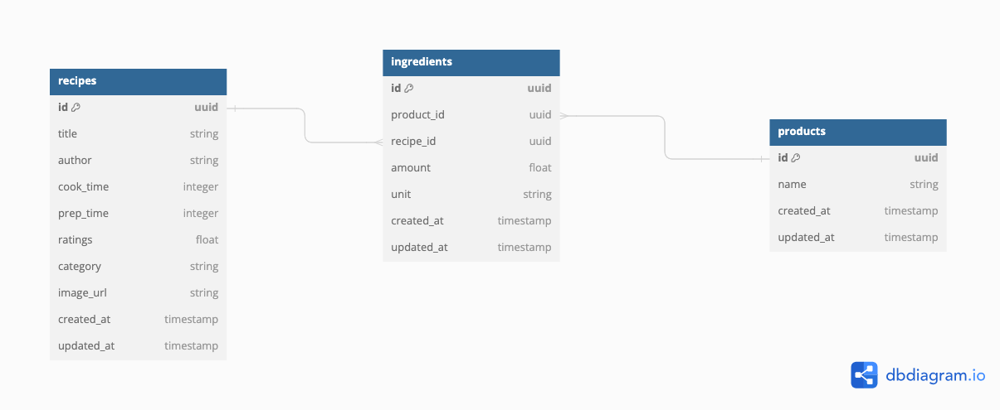

# Bonne App Petit by Jan Taras

This is my solution for Pennylane recruitment task. Feel free to use it as a point of reference for your work.

## Demo (run by Selenium)


## Task
[Task Description](https://gist.github.com/quentindemetz/2096248a1e8d362e669350700e1e6add)


## Hosted app

[VERSION WITH SEARCH](https://bonne-app-api-search-1234.fly.dev/)

[DEPRECATED OLD VERSION](https://bonne-app-api-delicate-fire-1453.fly.dev/)

## Setup

### Backend Setup
For now local development is used for the repo.
Before starting, make sure that you have `postgres` `wget` and `gzip` installed on your system

If you have a Mac machine run:
```shell
brew install \
wget \
gzip \
postgresql@15
```

If you have a Linux (Debian/Ubuntu) machine run:
```shell
sudo apt-get install wget gzip
```

For installation of Postgres on Ubuntu consult the official [Ubuntu docs](https://ubuntu.com/server/docs/install-and-configure-postgresql) 

First time setup
```shell
cd bonne_app_api
bundle install
bundle exec rails db:setup
```

Run Development Server
```shell
bundle exec rails serve
```

Run Specs
```shell
bundle exec rspec
```

Download Assets for Seeding Manually
```shell
bundle exec rake recipes:download
```

### Frontend Setup

First time setup:
```shell
cd bonne_api_frontend
npm install
```

Run Development Server:
```shell
npm start
```

Build Assets:
```shell
npm run build
```

Build Assets and move them to main app (run in main project directory):
```shell
make build_frontend
```

## Solution Architecture

I decided to use monorepo pattern to divide my code.

Directory `bonne_app_api` hosts Rails 7 app,
while the React frontend is developed in `bonne_app_frontend`.

The React app produces static files which are in the build process, and
in the end hosted by Rails as SPA.

[Makefile](./Makefile) was made to facilitate the above as well as the deployment process.

### Database
Database structure is a simple many-to-many solution with 3 tables in place.



`Recipe` as the representation of recipe
`Product` as the representation of a food item
`Ingredient` as a junction object, containing data abuo the quantity used

Primary keys are in UUID, being more flexible than sequential primary keys

Unique index on the `ingredients` table was introduced to prevent allowing repeating ingredients in recipes (eggs listed twice)
Other indices were made for performance.

Database seeding automatically pulls the files with recipes if it does not detect them. It uses rake task under the hood to do so.

### Backend
Standard Rails 7 app with API.
API is versioned to allow for future growth.

Added Rubocop for styling, RSpec for tests.
Used repository pattern to host more complex queries, explained why in [./bonne_app_api/docs/01-repositories_pattern.md](this doc)

### Frontend
Frontend was made as a standard React singe page app.
Prime React components were used to design UI.
Tailwind was chosen as a styling library.

The React app is built and then served on the root endpoint of the Rails App.

## Automation Specs

In order to make sure the User scenarios are fulfilled I wrote Selenium automation covering 3 simplest cases.

## Setup
```shell
bundle install
```

Also make sure to have Chrome installed ;)

## Run Automation

```shell
bundle exec rspec
```

Each spec corresponds to a scenario from:
https://trello.com/b/Px0Zsc6H/bonne-app-petit

### Project Tracking
I have made a simple trello board for tracking the progress, (and not to forget anything ;). I have marked all the commits with the corresponding tickets.

https://trello.com/invite/b/Px0Zsc6H/ATTI2fb78e7d591883891773e8fd4026933b294B293B/bonne-app-petit

## User Driven Design - implemented scenarios

I decided to implement 3 user stories:

1. User searches for recommended recipes from ingredients they have at home
```
Given "I am a person working from home, I have eggs, sugar and bananas in the kitchen"
When "I go to Bonne App Petit, select eggs sugar and bananas from the multiselect"
Then "Recipes containing the ingredients are displayed"
And "The order of recipes follows how many of the ingredients they use from the ones using most of my ingredients - I can see it on the Match score"
```

2. User does not have oven at home, and can only make cold dishes
```
Given "I am a person camping, I do cannot cook / start fire in the national park, I have honey and egg"
When "I go to Bonne App Petit, select honey and egg from the multiselect"
And "I select checkbox to show only cold dishes"
Then "Recipes containing the ingredients mentioned are displayed"
And "The order of recipes follows how many of the ingredients they use - I can see it on the Match score"
And "Only ingredients that require no cooking are shown - I can see this in `No cooking needed` badge"
```
3. User wants to only search for recipes with certain rating
```
Given "I am a picky eater, I need only good recipes, I have milk, butter, and sugar in my pantry"
When "I go to Bonne App Petit, select milk, butter, and sugar from the multiselect"
And "I select four stars on the minimal rating"
Then "Recipes containing the ingredients mentioned are displayed"
And "The order of recipes follows how many of the ingredients they use - I can see it on the Match score"
And "Only ingredients with 4 or more star rating are shown"
```
## User Driven Design - possible future scenarios

4. User wants to only search for recipes that take less than stated amount of time
```
Given "I am in a hurry, I need recipes to be done under an hour, I have milk, butter, and sugar in my pantry"
When "I go to Bonne App Petit, select milk, butter, and sugar from the multiselect"
And "I select max prep time as 1 hour in the slider"
Then "Recipes containing the ingredients mentioned are displayed"
And "The order of recipes follows how many of the ingredients they use - I can see it on the Match score"
And "All the recipes have at most 60 minutes prep time"
```

5. User wants to only search vegan recipes
```
Given "I am vegan, I need only good recipes, I have sugar, banana, and flour in my fridge"
When "I go to Bonne App Petit, select sugar, banana, and flour from the multiselect"
And "I mark Vegan Only checkbox"
Then "Recipes containing the ingredients mentioned are displayed"
And "The order of recipes follows how many of the ingredients they use - I can see it on the Match score"
And "I can see only vegan recipes - vegan badge assures me of that"
```

## Culture

It is vital to me for this repo to be friendly for other developers.
Therefore I have added simple instructions on installing required software, project setup and deployment.

I have made it a monorepo as for small projects with collaborators I have found this pattern to be the most productive.

## Ideas for tech improvements

1. React Snapshots specs with Jest
2. Adding text search to Food Selection components [done]
3. Adding CI/CD
4. include dry gems for params validation [done]
5. DSL for Selenium specs use cucumber BDD
6. Fix fronend loading the assets on first run flakiness
7. Optimize repository queries with explain
